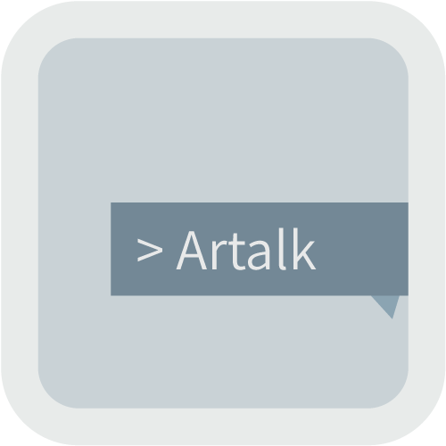

<p align="center">

</p>

# Artalk
> 一款简洁有趣的自托管评论系统

[](https://www.npmjs.com/package/artalk)
[](https://www.npmjs.com/package/artalk)
[](https://github.com/qwqcode/Artalk/commits/master)
[](https://github.com/qwqcode/Artalk/issues)
[](https://github.com/qwqcode/Artalk/pulls)
[](./LICENSE)
[](#捐助)

## 特性
- 简洁 (~25kB gzipped)
- 有趣
- 自托管
- Markdown
- 自定表情 #(滑稽)
- 管理员认证，防冒名
- 评论打分

## 食用
[查看 DEMO](https://artalk.js.org) / [查看代码](./demo/index.html)

## 开发

### Build

```bash
git clone https://github.com/qwqcode/Artalk.git
cd Artalk
yarn install
yarn run build
```

### Dev

```bash
git clone https://github.com/qwqcode/Artalk.git
cd Artalk
yarn install
yarn run dev
```

## 捐助

如果您觉得我的项目对您有帮助，并且您愿意给予我一点小小的支持，您可以通过以下方式向我捐助，这样可以维持项目持续地发展，非常感谢！(/ω＼)

| Alipay | Wechat | 
| :------: | :------: | 
|  |  | 

捐赠者的名字将保存于 [捐赠者列表](https://github.com/qwqcode/donate-qwqaq)

最后，我再次对您致以诚挚的感谢！

## License
[GPL-2.0](./LICENSE)
