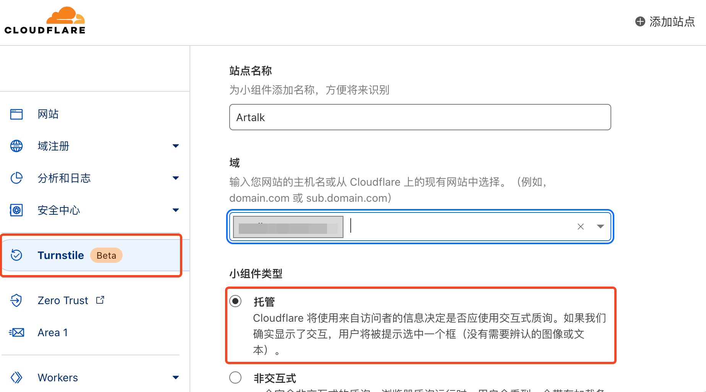
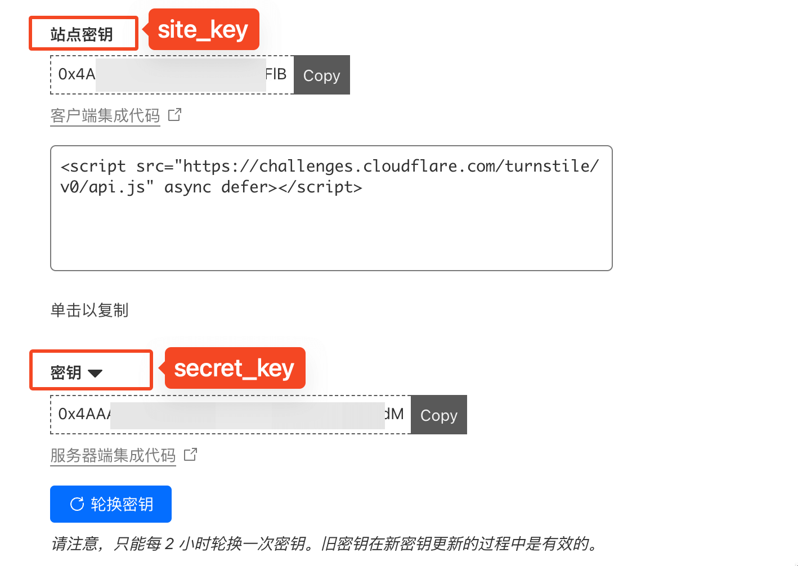

# 验证码

Artalk 内置图片验证码功能，你可以配置操作频率限制，当超过限度时激活验证码。

此外，你也可以接入各种验证服务提供商，获得多样化的验证功能。

目前 Artalk 支持：Turnstile、reCAPTCHA、hCaptcha、极验。

你可以在[控制中心](/guide/frontend/sidebar.md#控制中心)找到「设置」界面修改此配置。

## 配置文件

完整的 `captcha` 配置如下：

```yaml
# 验证码
captcha:
  enabled: true # 总开关
  always: false # 总是需要验证码
  captcha_type: image # 验证码类型
  action_limit: 3 # 激活验证码所需操作次数
  action_reset: 60 # 重置操作计数器超时 (单位：s, 设为 -1 不重置)
  # Turnstile
  # (https://www.cloudflare.com/products/turnstile/)
  turnstile:
    site_key: ''
    secret_key: ''
  # reCaptcha
  # (https://www.google.com/recaptcha/about/)
  recaptcha:
    site_key: ''
    secret_key: ''
  # hCaptcha (https://www.hcaptcha.com/)
  hcaptcha:
    site_key: ''
    secret_key: ''
  # Geetest 极验 (https://www.geetest.com)
  geetest:
    captcha_id: ''
    captcha_key: ''
```

- **always**：当该项为 `true` 时，总是需要输入验证码。
- **captcha_type**：验证码类型，可选：`image`、`turnstile`、`recaptcha`、`hcaptcha`、`geetest`。
- **action_limit**：激活评论所需的操作次数。
- **action_reset**：当时间超过该值时会重置操作计数器，单位为秒，设为 `-1` 将永不重置。

注：当 `always` 开启时，`action_limit` 和 `action_reset` 配置将失效。

## 配置举例

### 例 1

在 60s 时间范围内，当操作次数超过 3 次，将一直被要求输入验证码：

```yaml
captcha:
  action_limit: 3
  action_reset: 60
```

在 60s 后将自动重置计数器，即重新获得 3 次不用输入验证码的机会。

### 例 2

无论多少时间范围内，这个 IP 地址操作次数只要超过 5 次时，将一直被要求输入验证码：

```yaml
captcha:
  action_limit: 5
  action_reset: -1
```

### 例 3

总是要求输入验证码，无论这个 IP 操作多少次：

```yaml
captcha:
  always: true
```

## 操作的定义

一个 IP 地址的一次「评论、投票、图片上传、密码验证」都算作一次「操作」。

## Turnstile

[Turnstile](https://www.cloudflare.com/zh-cn/products/turnstile/) 是 Cloudflare 推出的无感验证服务，可在 CF 后台申请获得 `site_key` 和 `secret_key`，之后在 Artalk 控制中心设置页填入 Key 并将 `captcha_type` 修改为 `turnstile` 即可。

图示：





对应配置文件如下：

```yaml
captcha:
  # 省略其他配置...
  captcha_type: turnstile
  turnstile:
    site_key: ''
    secret_key: ''
```

## reCAPTCHA

[reCAPTCHA](https://developers.google.com/recaptcha) 是 Google 推出的验证服务，Artalk 支持接入 reCAPTCHA v3。可在谷歌开发者后台申请获得 `site_key` 和 `secret_key`，之后在 Artalk 控制中心设置页填入 Key 并将 `captcha_type` 修改为 `recaptcha` 即可。

对应配置文件如下：

```yaml
captcha:
  # 省略其他配置...
  captcha_type: recaptcha
  recaptcha:
    site_key: ''
    secret_key: ''
```

注：国内访问 Google API 也许需要配置系统代理。

reCAPTCHA 官方提供了用于测试的 Keys：[可见此处](https://developers.google.com/recaptcha/docs/faq?hl=en#id-like-to-run-automated-tests-with-recaptcha.-what-should-i-do)。

## hCaptcha

[hCaptcha](https://www.hcaptcha.com/) 是一个验证服务，可在其官网申请获得 `site_key` 和 `secret_key`，之后在 Artalk 控制中心设置页填入 Key 并将 `captcha_type` 修改为 `hcaptcha` 即可。

对应配置文件如下：

```yaml
captcha:
  # 省略其他配置...
  captcha_type: hcaptcha
  hcaptcha:
    site_key: ''
    secret_key: ''
```

hCaptcha 官方提供了用于测试的 Keys：[可见此处](https://docs.hcaptcha.com/#integration-testing-test-keys)。

## Geetest 极验

Artalk 支持接入 [Geetest 极验](https://www.geetest.com/adaptive-captcha) 第四代行为验。

首先在 Geetest 官网注册账号申请获得 `captcha_id` 和 `captcha_key`，然后在 Artalk 控制中心修改配置，并将 `captcha_type` 修改为 `geetest` 即可。

对应配置文件如下：

```yaml
captcha:
  # 省略其他配置...
  captcha_type: geetest
  geetest:
    captcha_id: ''
    captcha_key: ''
```
